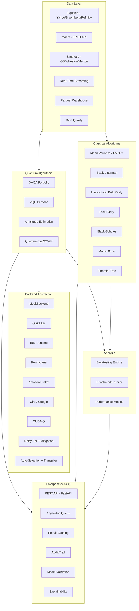

# qufin

**Research-grade quantum algorithms for quantitative finance.**

[](https://opensource.org/licenses/Apache-2.0)

---

## What is qufin?

`qufin` is a Python library that brings quantum amplitude estimation, QAOA/VQE portfolio optimization, quantum credit-risk analysis, and quantum deep hedging into one package — with **classical baselines on every problem** and a **standardized benchmark harness** for honest quantum-vs-classical comparison.

## Why qufin?

- **Qiskit Finance** is in community-maintenance mode since 2023
- **PennyLane** has no finance modules
- ~80% of 2024-2025 quantum-finance papers ship without code

qufin fills this gap with production-grade implementations that run on simulators today and real quantum hardware tomorrow.

## Architecture



## Quick Example

```python
from qufin.options.european import EuropeanOption

opt = EuropeanOption(s0=100, k=105, sigma=0.2, r=0.05, T=1.0)
print(f"Price: ${opt.bs_price():.2f}")
print(f"Delta: {opt.bs_delta():.4f}")
print(f"Gamma: {opt.bs_gamma():.4f}")
```

## Package Overview

| Module | Classical | Quantum |
|--------|-----------|---------|
| `portfolio` | Mean-Variance, Black-Litterman, HRP, Risk Parity, Multi-Period, Factor Models, Sector Rotation | QAOA (X/XY/Grover mixers), VQE (CVaR), Szegedy Walk, Robust CVaR QUBO, ADMM, Hybrid |
| `options` | Black-Scholes, Monte Carlo, Binomial (CRR), American (LSM), Implied Vol Surface | Canonical QAE, IQAE, MLAE, FQAE, Path-Dependent QAE, American QAE |
| `risk` | Historical/Parametric VaR, CVaR, Stress Testing | Quantum VaR, Credit Risk (Egger), Quantum Stress Testing |
| `hedging` | Delta Hedging | Deep Hedging, Quantum Deep Hedging |
| `backends` | — | Qiskit Aer, IBM Runtime, PennyLane, Amazon Braket, Cirq, CUDA-Q, Noise Models, Error Mitigation (ZNE, TREX, PEC, CDR), M3 Mitigation, Dynamical Decoupling, Finance Transpiler, Noise-Aware Optimizer, Auto-Selection |
| `data` | Yahoo Finance, FRED, Bloomberg, Refinitiv, Streaming, Parquet Warehouse, Quality Scoring | — |
| `backtesting` | Walk-Forward Engine, 15+ Performance Metrics | — |
| `benchmarks` | Standardized Problems, Leaderboard | Scaling Analysis, Hardware Benchmarks (IonQ, IBM) |
| `api` | REST API (FastAPI), Async Job Queue (Celery), Result Caching | — |
| `compliance` | Audit Trail, Model Validation (SR 11-7/SS1/23), Champion-Challenger, Explainability (SHAP, QUBO decomposition) | — |
