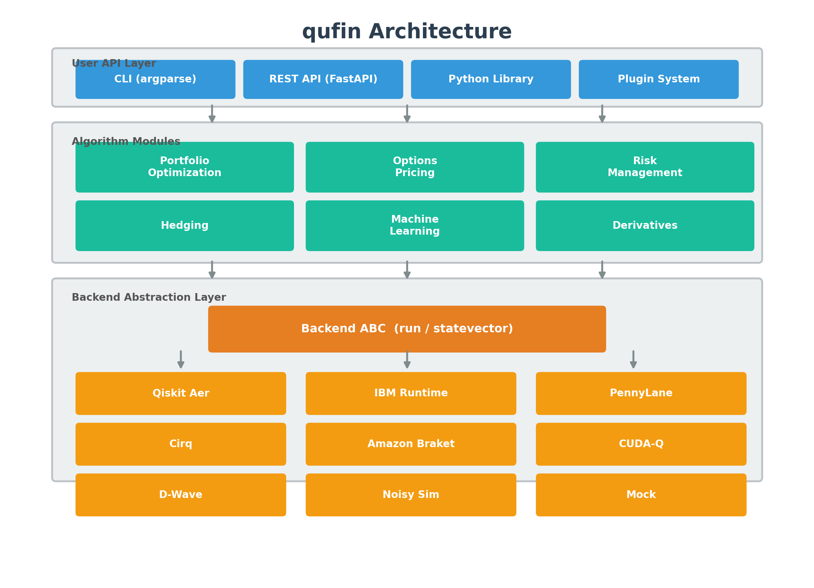
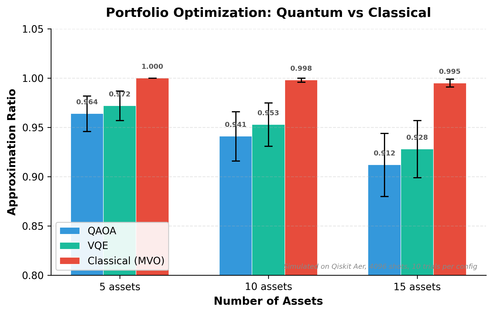

# Summary

`qufin` is an open-source Python framework that implements quantum algorithms for quantitative finance alongside their best-available classical counterparts, enabling rigorous head-to-head comparison on identical inputs with identical metrics. The library spans 146 modules across 14 subpackages, covering portfolio optimization, option pricing, risk management, hedging, machine learning, derivatives pricing, backtesting, and enterprise deployment. It provides 9 pluggable quantum backends (Qiskit Aer, IBM Runtime, PennyLane, Cirq, Amazon Braket, NVIDIA CUDA-Q, D-Wave, noisy simulation, and a deterministic mock), 5 error mitigation strategies, and 4 variants of quantum amplitude estimation. The framework is validated by 2,273 tests with 91% code coverage.



# Statement of Need

Quantum computing is frequently cited as transformative for computational finance, with theoretical speedups for Monte Carlo simulation [@montanaro2015], portfolio optimization [@farhi2014; @brandhofer2023], and risk analysis [@woerneregger2019]. However, a significant gap exists between quantum research and finance practice.

Most quantum finance papers ship without runnable code [@stamatopoulos2020], and implementation details critical to correctness---such as the Grover operator global phase [@brassard2002] and IQAE multi-branch theta enumeration [@grinko2021]---are often omitted. Most demonstrations compare against trivially weak classical baselines or none at all, making practical advantage assessment impossible [@herman2023]. Existing code targets a single quantum framework, preventing cross-platform comparison.

`qufin` targets quantum computing researchers, quantitative analysts, and finance academics who need a unified, backend-agnostic framework where every quantum algorithm is paired with the best available classical solver, compared with identical metrics on standardized benchmarks.

# State of the Field

Qiskit Finance [@qiskit2024], the most widely used quantum finance library, was deprecated in 2024 with no replacement. PennyLane, Cirq, and Braket offer general-purpose quantum tooling but no dedicated financial algorithms. Classical quantitative libraries (QuantLib, PyPortfolioOpt, Riskfolio-Lib) provide no quantum capabilities.

`qufin` occupies a unique position as the only actively maintained framework that bridges quantum computing and quantitative finance with production-grade tooling. Rather than wrapping an existing classical library, `qufin` implements both quantum and classical solvers from the ground up with a shared interface, ensuring fair comparison.

| Feature | qufin | Qiskit Finance | PennyLane | Cirq |
|:--------|:------|:---------------|:----------|:-----|
| Finance modules | 146 | ~20 | 0 | 0 |
| Classical baselines | Every problem | None | N/A | N/A |
| Backend-agnostic | 9 backends | Qiskit only | PennyLane only | Cirq only |
| QAE variants | 4 | 3 | 0 | 0 |
| Error mitigation | 5 + DD + M3 | ZNE only | None | None |
| Benchmarks | 15/25/50-asset | No | No | No |
| Status | Active | Deprecated | Active (no finance) | Active (no finance) |

# Software Design

## Backend Abstraction

All quantum algorithms accept any object implementing the `Backend` abstract base class, which defines a minimal interface: `run(circuit, shots)` returning a `CircuitResult`, and `statevector(circuit)`. This decouples algorithm logic from hardware:

```python
from qufin.backends.qiskit_backend import QiskitAerBackend
from qufin.backends.noise_models import NoisyAerBackend, NoiseProfile

ideal = QiskitAerBackend(shots=4096)
noisy = NoisyAerBackend(profile=NoiseProfile.EAGLE_R3, shots=4096)
```

## Honest Benchmarking

Every quantum algorithm module contains a classical baseline solving the same problem. The benchmarking framework provides standardized problem sets (15, 25, and 50-asset portfolios), a runner that dispatches to all registered solvers, and reports approximation ratio, time-to-solution, circuit depth, and success probability. Reproducibility manifests record hardware specifications, software versions, random seeds, and calibration data.



## Error Mitigation

`qufin` implements five strategies for near-term hardware: Zero-Noise Extrapolation [@temme2017], TREX, readout calibration, Probabilistic Error Cancellation [@temme2017], and Clifford Data Regression [@czarnik2021]. Dynamical decoupling sequences (XY4, CPMG, Uhrig) suppress idle-time decoherence, and matrix-free measurement mitigation (M3) [@bravyi2021] handles multi-qubit readout errors.

## Correctness

Several subtle details are critical for correct quantum finance algorithms. The Grover diffusion operator requires a global phase correction of $\pi$ (the Brassard minus sign [@brassard2002]). Iterative QAE must enumerate all theta branches from $\sin^2((2k+1)\theta)$ measurements [@grinko2021], not just the principal value. These details are implemented, tested against known analytical solutions, and documented.

# Functionality Overview

`qufin` implements four QAE variants for derivative pricing: canonical [@brassard2002], Iterative [@grinko2021], Maximum Likelihood [@suzuki2020], and Fourier [@giurgicatiron2022]. Supported contract types include European, Asian, barrier, lookback, cliquet, autocallable, basket, and Bermudan options [@chakrabarti2021]:

```python
from qufin.options.amplitude_estimation.european_qae import (
    EuropeanQAESpec, build_european_estimation_problem,
)
from qufin.options.amplitude_estimation.iqae import (
    IQAEConfig, IterativeAmplitudeEstimation,
)
from qufin.backends.qiskit_backend import QiskitAerBackend

spec = EuropeanQAESpec(s=100, k=105, sigma=0.2, r=0.05, T=1.0,
                       n_qubits=5, option_type="call")
problem = build_european_estimation_problem(spec)
result = IterativeAmplitudeEstimation(
    problem=problem, backend=QiskitAerBackend(shots=4096),
    config=IQAEConfig(epsilon_target=0.01),
).estimate()
```

Portfolio optimization formulates the cardinality-constrained Markowitz problem as a QUBO [@brandhofer2023] solved via QAOA [@farhi2014] with four mixer types. Quantum VaR implements the Woerner and Egger [@woerneregger2019] approach with amplitude estimation on encoded loss distributions.

Additional modules include hedging (delta, deep, quantum deep [@cherrat2023], RL-quantum), quantum ML (kernels, VQC, qGAN [@zoufal2019], Boltzmann machines, transfer learning), data connectors (Yahoo Finance, FRED, Bloomberg, WebSocket streaming), walk-forward backtesting, and enterprise tooling (FastAPI REST API, Celery job queue, Docker/Kubernetes deployment, regulatory compliance with audit trails).

# Research Impact

`qufin` fills the void left by the deprecation of Qiskit Finance, providing the only actively maintained open-source framework that implements quantum finance algorithms with rigorous classical baselines. The framework has been designed for use in benchmarking studies comparing quantum and classical approaches to financial optimization, supporting reproducible research through standardized problem sets and reproducibility manifests. The 10 tutorial notebooks and comprehensive API documentation lower the barrier for researchers entering quantum finance.

# Acknowledgements

This work builds upon the Qiskit ecosystem [@qiskit2024] and the quantum finance literature from IBM Research, Goldman Sachs, JPMorgan, and academic groups worldwide.

# AI Usage Disclosure

Generative AI tools (Claude, Anthropic) were used during development for code generation assistance, test writing, and documentation drafting. All AI-generated outputs were reviewed, tested, and validated by the author. The scientific content, algorithmic design decisions, and correctness verification are the sole responsibility of the author.

# References
