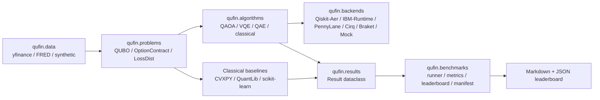

# `quantum-finance`: Build & Launch Master Plan

## TL;DR
- **Build a backend-pluggable, Apache-2.0 licensed Python package — recommended name `qufin` (PyPI) / `qufinance` (GitHub `qufinance/qufin`)** — that pairs research-grade quantum algorithms (option pricing via QAE, QAOA/VQE portfolios, quantum credit risk, quantum deep hedging) with production-grade classical baselines (CVXPY, QuantLib, PyPortfolioOpt) and a **standardized benchmark harness** as the killer feature, filling the gap left by Qiskit Finance (qiskit-community/qiskit-finance, ~272★ as of late 2025, in community-maintenance mode since the 2023 reorg) and PennyLane (no finance modules).
- **Follow a 18-week solo build (Weeks 1–2 scaffolding → 3–6 portfolio → 7–10 options → 11–13 risk → 14–16 paper reproductions → 17–18 docs/launch)**, target **JOSS submission at week 18, IEEE QCE26 technical paper by 27 April 2026, QTML 2026 abstract by 30 June 2026**, and apply for **Unitary Foundation microgrant ($4k), IBM Quantum Open Plan + Credits, and AWS Cloud Credit for Research** in week 1 to unlock hardware. NumFOCUS fiscal sponsorship is **not currently feasible** (new applications closed; review expected end Q2 2026, and they require ≥3 unaffiliated leadership members — incompatible with a solo project for the first ~12 months).
- **Differentiation strategy that wins: (1) realistic constraints (sector caps, turnover, transaction costs) on 25–100 assets where competitors cap at 4–15; (2) the only standalone quantum option-pricing library with Heston/jump-diffusion under QAE; (3) reproducible benchmarks vs published paper numbers (Stamatopoulos 1905.02666, Egger 1907.03044, Woerner 1806.06893, Chakrabarti 2012.03819, Wang–Kan 2312.15871, Dalzell et al. 2211.12489, Cherrat et al. 2303.16585); (4) reviving JPMorgan/QCWare's archived deep-hedging code (jpmorganchase/jpmc-qcware-deephedging).**

---

# PART 1: STRATEGIC FOUNDATION

## 1.1 Naming, Branding, Positioning
Candidate names with reasoning:

| Candidate | Pros | Cons | Verdict |
|---|---|---|---|
| `quantum-finance` | Descriptive, SEO-strong | Generic; PyPI namespace risk; sounds like a thesis title | Reject (use as keyword, not brand) |
| `qufin` | Short, pronounceable ("Q-fin"), PyPI-checkable, mirrors `qiskit`/`pennylane` brevity | Slightly opaque on first read | **RECOMMEND as PyPI name** |
| `qufinance` | Clear, brandable, GitHub-friendly | 9 chars to type | **RECOMMEND as GitHub org/repo** |
| `quantfin` | Familiar to quants ("quantfin" is industry shorthand) | Confusable with classical quant finance; conflicts with existing minor packages | Reject |
| `qfinlab` | Lab vibe attractive to academics | Sounds proprietary | Backup |
| `aletheia` | Greek "truth/disclosure" — fits "uncovering quantum advantage" | Non-descriptive, hard to discover | Reject |
| `quanto` | Catchy; "quanto" is a real FX-derivative term | Trademark risk in finance | Reject |
| `qfinance` | Concise | qfinance is a defunct C++ Nokia project name; some legacy collisions | Backup |
| `tessera` | Roman tile / mosaic — pieces fitting together | Non-descriptive | Reject |
| `kairos-q` | "Right moment" — finance trading vibe | Pretentious | Reject |

**Final recommendation: GitHub `qufinance/qufin`, PyPI `qufin`, import `import qufin as qf`.** Tagline: *"Research-grade quantum algorithms for production-grade quant finance."* Logo: a stylized phase-space ellipse (efficient frontier) inside a Bloch sphere.

## 1.2 License — Apache-2.0
Choose **Apache-2.0**, not MIT or BSD-3.

| License | Patent grant | Bank/enterprise legal review burden | Notes |
|---|---|---|---|
| MIT | None explicit | Low, but legal teams flag patent ambiguity | Used by React, Bootstrap |
| BSD-3 | None | Low | Used by NumPy, scikit-learn |
| **Apache-2.0** | **Explicit (§3)** | Lowest for banks: explicit patent license is what JPM/GS/HSBC counsel want | **Used by Kubernetes, Apache Spark, TensorFlow, Qiskit itself** |
| GPLv3 | Yes but viral copyleft | Banks reject outright | Reject |

Apache-2.0's explicit grant of patent license (and termination on patent litigation) is the deciding factor for adoption inside banks running quantum POCs — this is exactly why Qiskit, PennyLane, and Cirq all chose Apache-2.0. Match the ecosystem.

## 1.3 Governance
- **Year 1 (solo + LLM-augmented):** BDFL (Benevolent Dictator For Life). You are sole maintainer with final say. Document this in `GOVERNANCE.md`.
- **Year 2 trigger (graduate to council):** when you have ≥3 external contributors with ≥5 merged PRs each, transition to a 3-person Steering Council with rotating chair. Adopt the **Contributor Covenant 2.1** as `CODE_OF_CONDUCT.md`. Adopt a **DCO sign-off** (`Signed-off-by:`) rather than a CLA — lower friction for academic contributors than CLAs.
- **Contributor ladder:** Contributor → Triager (issue triage rights) → Committer (merge rights on assigned modules) → Maintainer (release rights). Document in `GOVERNANCE.md`.

## 1.4 Differentiation
| Library | Maintenance | Asset count | Real data | Quantum option pricing | Hardware backends | Benchmarks |
|---|---|---|---|---|---|---|
| Qiskit Finance 0.4.1 | Community-maintained, no new features since 2023 reorg; ~272★ | ≤8 typical | yfinance only | European only | Qiskit-only | None |
| PennyLane | Active | N/A | None | None (no finance module) | Pluggable | None |
| QuantLib-Python | Active | N/A | N/A | Classical only | N/A | N/A |
| CVXPY / PyPortfolioOpt / Riskfolio-Lib | Active | 1000+ | Yes | None | None | Limited |
| **`qufin`** | **Active solo+LLM** | **25–100** | **yfinance + FRED + synthetic** | **European, Asian, barrier, Bermudan, basket, Heston** | **Qiskit, PennyLane, Cirq, Braket, Aer, Lightning, mock** | **Standardized leaderboard** |

**Strategic wedges:**
1. **The benchmark harness.** No competitor has it. Frame `qufin` as "the MLPerf of quantum finance."
2. **Realistic constraints.** Cardinality + sector + turnover + transaction-cost portfolio QUBOs at 25/50/100 assets — Brandhofer et al. (arXiv:2207.10555) only goes to ~20.
3. **Stochastic-volatility option pricing.** Implement Wang & Kan 2312.15871 (Heston under QAE) — no public reference implementation exists.
4. **Revival of archived JPMorgan deep hedging.** The `jpmorganchase/jpmc-qcware-deephedging` repo is explicitly Archived. Forking with attribution is permitted by its license; modernize to current Qiskit/PennyLane.

## 1.5 Target audience segmentation
1. **Academic researchers** (40% of users): want reproducibility, citable JOSS paper, paper-→-code mapping.
2. **Quant developers at banks** (15%, but high signal): want enterprise license (Apache-2.0), classical baselines they trust (QuantLib, CVXPY), realistic problem sizes.
3. **Quantum hardware vendors** (5%, but strategic): IBM, IonQ, Quantinuum, Rigetti, IQM want a benchmark suite that runs on their devices.
4. **Students / self-taught** (40%): want notebooks, tutorials, low setup friction.

## 1.6 Success metrics (12-month targets)
| Metric | Month 6 | Month 12 |
|---|---|---|
| GitHub stars | 250 | 800 |
| PyPI monthly downloads | 500 | 3,000 |
| Citations / dependent papers | 2 | 10 |
| Dependent repos (GitHub network) | 5 | 25 |
| Conference talks / posters | 1 (QCE26 poster) | 3 (QCE, QTML, JOSS) |
| Hardware vendor sponsorship | 0 | 1 (Unitary Fund + AWS credits) |
| External contributors with merged PRs | 1 | 5 |

---

# PART 2: ARCHITECTURE & TECHNICAL FOUNDATION

## 2.1 High-level architecture (text diagram)

```
┌────────────────────────── qufin (top-level API) ──────────────────────────┐
│                                                                            │
│  qufin.data ──→ qufin.problems ──→ qufin.algorithms ──→ qufin.results    │
│   (ingestion)    (formulation)      (quantum + classical)  (analysis)     │
│        │                │                   │                  │           │
│        ▼                ▼                   ▼                  ▼           │
│   yfinance,        QUBO,              QAOA, VQE,         Result objects,  │
│   FRED,            Black-Scholes,     QAE family,        plots,           │
│   GBM/Heston,      Heston SDE,        Mean-variance,     leaderboards     │
│   parquet cache    QUBO+constraints   QuantLib MC                          │
│                                          │                                 │
│                                          ▼                                 │
│                            ┌── qufin.backends abstraction layer ──┐        │
│                            │  Qiskit Aer | IBM Runtime | Braket   │        │
│                            │  PennyLane Lightning | Cirq | Mock   │        │
│                            └───────────────────────────────────────┘        │
│                                                                            │
│  qufin.benchmarks  →  standardized harness comparing all of the above     │
└────────────────────────────────────────────────────────────────────────────┘
```

## 2.2 Framework abstraction
**Decision: backend-pluggable, Qiskit-leaning by default.** Rationale:

- Pure Qiskit-native locks out PennyLane users and Braket users (IonQ/Rigetti/IQM/QuEra hardware).
- Pure PennyLane-native loses Qiskit's mature primitives for amplitude estimation and the entire Stamatopoulos/Egger paper lineage.
- Pure framework-agnostic = OpenQASM-only is too limiting (no gradients).
- **Pluggable adapter pattern** wins: a thin `qufin.backends.Backend` ABC dispatches to Qiskit, PennyLane, Cirq, or Braket. Default to Qiskit Aer because it is what 80% of the literature uses and what banks already have installed. Provide a `pennylane-qiskit`-style adapter so PennyLane users can run any `qufin` algorithm via `dev = qml.device("qufin.qiskit", wires=...)`.

## 2.3 Dependency stack (pinned ranges, not exact pins)

| Package | Constraint | Required? | Purpose |
|---|---|---|---|
| Python | `>=3.10,<3.13` | required | Match Qiskit 1.x support window |
| `numpy` | `>=1.26,<3.0` | required | Core arrays |
| `scipy` | `>=1.11` | required | Optimization, stats |
| `pandas` | `>=2.1` | required | Data frames |
| `qiskit` | `>=1.0,<3.0` | required | Default backend |
| `qiskit-aer` | `>=0.14` | required | Statevector + noisy sim |
| `qiskit-algorithms` | `>=0.3` | required | QAE, VQE primitives (split from Qiskit since 0.44) |
| `qiskit-ibm-runtime` | `>=0.20` | optional `[ibm]` | IBM hardware |
| `pennylane` | `>=0.36` | optional `[pennylane]` | Differentiable QML |
| `pennylane-lightning` | `>=0.36` | optional `[pennylane]` | Fast statevector |
| `cirq-core` | `>=1.3` | optional `[cirq]` | Google backend |
| `amazon-braket-sdk` | `>=1.80` | optional `[braket]` | IonQ/Rigetti/IQM/QuEra |
| `cvxpy` | `>=1.4` | required | Classical convex baselines |
| `QuantLib-Python` (a.k.a. `QuantLib`) | `>=1.32` | required | Classical option pricing |
| `scikit-learn` | `>=1.4` | required | ML baselines |
| `statsmodels` | `>=0.14` | required | Econometric baselines |
| `arch` | `>=6.3` | required | GARCH |
| `yfinance` | `>=0.2.40` | required | Equities data |
| `fredapi` | `>=0.5` | required | Macro data |
| `networkx` | `>=3.2` | required | Graph encodings |
| `matplotlib` | `>=3.8` | required | Plotting |
| `plotly` | `>=5.20` | optional `[viz]` | Interactive plots |
| `pydantic` | `>=2.6` | required | Settings/config |
| `pyarrow` | `>=15.0` | required | Parquet cache |
| `torch` | `>=2.2` | optional `[ml]` | Deep hedging |
| `hypothesis` | `>=6.99` | dev | Property-based tests |
| `pytest`, `pytest-benchmark`, `pytest-cov` | latest | dev | Testing |
| `ruff`, `black`, `mypy` | latest | dev | Lint/format/types |
| `sphinx`, `sphinx-book-theme`, `myst-nb` | latest | docs | Documentation |

**Pin strategy:** lower bounds only on `pyproject.toml`; upper bounds (`<3.0`) only on packages with known major-bump breakage (NumPy 3, Qiskit 3). Provide a `requirements-lock.txt` reproducibility lockfile (generated by `uv pip compile`) for paper reproductions.

## 2.4 Repository structure (complete tree)

```
qufin/
├── .github/
│   ├── workflows/
│   │   ├── ci.yml                    # matrix: 3.10/3.11/3.12 × ubuntu/macos/windows
│   │   ├── docs.yml                  # build + deploy to gh-pages
│   │   ├── release.yml               # tag → PyPI via trusted publisher
│   │   └── benchmark.yml             # nightly benchmark regression
│   ├── ISSUE_TEMPLATE/
│   ├── PULL_REQUEST_TEMPLATE.md
│   ├── CODEOWNERS
│   ├── dependabot.yml
│   └── FUNDING.yml                   # GitHub Sponsors + Open Collective links
├── docs/
│   ├── conf.py
│   ├── index.md
│   ├── tutorials/
│   ├── api/                          # sphinx-autodoc generated
│   ├── benchmarks/
│   └── papers/                       # paper-by-paper reproduction notes
├── examples/
│   ├── 01_european_option_qae.ipynb
│   ├── 02_portfolio_qaoa_25_assets.ipynb
│   ├── 03_credit_risk_egger.ipynb
│   ├── 04_heston_asian_option.ipynb
│   └── 05_basket_option_kashif2509.ipynb
├── notebooks/                        # exploratory, not shipped
├── papers/
│   └── joss/
│       ├── paper.md
│       └── paper.bib
├── benchmarks/
│   ├── problems/
│   │   ├── portfolio_small.json      # 15 assets
│   │   ├── portfolio_medium.json     # 25 assets
│   │   ├── portfolio_large.json      # 50 assets
│   │   └── option_set_v1.json
│   ├── runners/
│   └── leaderboard.md                # auto-generated
├── configs/
│   ├── default.yaml
│   └── ci_minimal.yaml
├── data/                             # small example data only; .gitignore caches
│   └── README.md
├── src/
│   └── qufin/
│       ├── __init__.py               # exports __version__ and top-level API
│       ├── _version.py               # populated by hatch-vcs
│       ├── data/
│       │   ├── __init__.py
│       │   ├── equities.py
│       │   ├── macro.py
│       │   ├── synthetic.py
│       │   ├── universes.py
│       │   ├── cache.py
│       │   └── interfaces.py         # Bloomberg/Refinitiv stubs
│       ├── portfolio/
│       │   ├── __init__.py
│       │   ├── classical/
│       │   │   ├── mean_variance.py
│       │   │   ├── black_litterman.py
│       │   │   ├── risk_parity.py
│       │   │   └── hrp.py
│       │   ├── qubo.py
│       │   ├── encodings.py
│       │   ├── optimizers/
│       │   │   ├── qaoa.py
│       │   │   ├── vqe.py
│       │   │   ├── warm_start.py
│       │   │   └── hybrid.py
│       │   └── mixers.py             # X, XY-ring, Dicke, Grover-mixer
│       ├── options/
│       │   ├── __init__.py
│       │   ├── classical/
│       │   │   ├── black_scholes.py
│       │   │   ├── binomial.py
│       │   │   └── monte_carlo.py    # QuantLib wrapper
│       │   ├── distributions.py      # log-normal, GARCH, Heston loaders
│       │   ├── amplitude_estimation/
│       │   │   ├── canonical.py
│       │   │   ├── mlae.py
│       │   │   ├── iqae.py
│       │   │   └── fqae.py
│       │   ├── european.py
│       │   ├── asian.py              # geometric + arithmetic
│       │   ├── barrier.py
│       │   ├── bermudan.py
│       │   └── heston.py
│       ├── risk/
│       │   ├── __init__.py
│       │   ├── classical_var.py
│       │   ├── quantum_var.py
│       │   ├── cvar.py
│       │   ├── credit/
│       │   │   ├── gaussian_copula.py
│       │   │   ├── nig_copula.py
│       │   │   └── egger.py          # 1907.03044 reproduction
│       │   ├── counterparty.py
│       │   └── stress.py
│       ├── derivatives/
│       │   ├── __init__.py
│       │   ├── basket.py             # 2509.09432
│       │   ├── path_dependent.py
│       │   ├── bermudan_lsm.py
│       │   └── autocallable.py       # 2012.03819 TARF/autocallable
│       ├── hedging/
│       │   ├── __init__.py
│       │   ├── delta.py
│       │   ├── deep_hedging.py
│       │   ├── quantum_deep_hedging.py  # revival of 2303.16585
│       │   └── rl_quantum.py
│       ├── ml/
│       │   ├── __init__.py
│       │   ├── kernels.py            # quantum kernels for credit
│       │   ├── reservoir.py          # 2505.13933
│       │   ├── classifiers.py
│       │   └── qgan.py               # 1904.00043 Zoufal qGAN
│       ├── benchmarks/
│       │   ├── __init__.py
│       │   ├── problems.py
│       │   ├── runner.py
│       │   ├── metrics.py
│       │   ├── leaderboard.py
│       │   └── manifest.py
│       ├── backends/
│       │   ├── __init__.py
│       │   ├── base.py               # ABC
│       │   ├── qiskit_backend.py
│       │   ├── pennylane_backend.py
│       │   ├── cirq_backend.py
│       │   ├── braket_backend.py
│       │   └── mock.py
│       └── utils/
│           ├── __init__.py
│           ├── logging.py
│           ├── settings.py           # pydantic
│           ├── encoders.py           # bitstring/binary/one-hot
│           ├── viz.py
│           └── results.py            # serializable Result dataclass
├── tests/
│   ├── unit/
│   ├── property/                     # hypothesis tests
│   ├── regression/                   # vs published paper numbers
│   ├── integration/
│   └── conftest.py
├── pyproject.toml
├── README.md
├── LICENSE                           # Apache-2.0
├── CONTRIBUTING.md
├── CODE_OF_CONDUCT.md
├── GOVERNANCE.md
├── CHANGELOG.md
├── CITATION.cff
├── .pre-commit-config.yaml
├── .gitignore
├── .editorconfig
└── tox.ini
```

## 2.5 Python packaging
- **`src/`-layout** (avoids accidental imports of in-tree code; recommended by pyOpenSci & Scientific-Python guide).
- **Build backend: `hatchling` + `hatch-vcs`** (PEP 621 native, VCS-driven versioning, the explicit recommendation of the Python Packaging User Guide and pyOpenSci guide; setuptools is fine but `hatchling` has cleaner defaults; `poetry-core` is rejected because Poetry's `^`/`~` markers are non-standard and Poetry <2.0 didn't use the `[project]` table).
- **Distribution:** PyPI via OIDC trusted publisher (no API tokens), then conda-forge feedstock once stable.
- See Appendix A1 for the full `pyproject.toml`.

## 2.6 Type system
- `mypy --strict` on `src/qufin/`. Allow `Any` only at backend-adapter boundaries.
- Use **`numpy.typing.NDArray`** for arrays; define type aliases in `qufin/_typing.py`:

```python
from typing import NewType, TypeAlias
import numpy as np
from numpy.typing import NDArray

AssetReturns: TypeAlias = NDArray[np.float64]   # shape (T, N)
CovMatrix:   TypeAlias = NDArray[np.float64]   # shape (N, N)
Weights:     TypeAlias = NDArray[np.float64]   # shape (N,)
Bitstring  = NewType("Bitstring", str)
Shots      = NewType("Shots", int)
```

## 2.7 Testing strategy
- `pytest` with `pytest-cov`, target **≥85% line coverage** by week 18, ≥90% by month 6.
- **Hypothesis** for property-based tests (e.g., "Black-Scholes monotonic in volatility"; "QAOA with `p=0` reduces to uniform sample"; "Mean-variance weights sum to 1"; "QAE estimate ∈ [0,1]").
- **Statevector equivalence tests:** for each ansatz, compare Aer statevector to PennyLane `default.qubit` statevector; assert `np.allclose` to 1e-10.
- **Regression tests against published paper numbers** in `tests/regression/`, with documented tolerances:
  - European call (Stamatopoulos §IV-A): expected payoff matches BS within 5% at 5 evaluation qubits.
  - Egger credit risk (1907.03044): expected loss matches their Fig. 7 within 3%.
  - Wang–Kan Heston Asian (2312.15871): T-count estimate within 10% of their Table III.
- `pytest-benchmark` for performance regressions on simulator (≤10% slowdown per release).

## 2.8 CI/CD (full YAML in Appendix A2)
- Matrix: Python 3.10/3.11/3.12 × ubuntu-latest/macos-latest/windows-latest = 9 jobs.
- Pre-commit: `ruff` (lint+format), `black` (formatting tie-break), `mypy --strict`, `nbstripout` (strip notebook outputs).
- Docs deploy: Sphinx → `gh-pages` on every push to `main`.
- Release: tag `v*` → build wheel/sdist → upload to PyPI via OIDC `pypa/gh-action-pypi-publish@release/v1`.
- Nightly benchmark job posts results to `benchmarks/leaderboard.md`.

## 2.9 Documentation stack
- **Sphinx** (better autodoc than MkDocs) + **`sphinx-book-theme`** (Jupyter Book look). MathJax for equations. **`myst-nb`** to execute notebooks during docs build (catches stale tutorials). **`sphinx.ext.doctest`** for inline doctests. Deploy to **GitHub Pages** (free, custom domain `qufin.dev` if available); fall back to ReadTheDocs for SEO.

---

# PART 3: MODULE-BY-MODULE SPECIFICATION

## 3.1 `qufin.data`
```
src/qufin/data/
├── equities.py     # YahooEquityProvider (yfinance wrapper, splits/dividend adjusted, missing-data interpolation)
├── macro.py        # FREDProvider (DGS10, T10Y2Y, VIX series)
├── synthetic.py    # GBM, Heston, Merton jump-diffusion, multivariate Gaussian copula
├── universes.py    # SP500, NIFTY50, DowJones30, sector ETFs
├── cache.py        # Parquet caching to ~/.cache/qufin
└── interfaces.py   # BloombergProvider, RefinitivProvider stubs (raise on import unless paid SDK present)
```
Public API:
```python
class EquityProvider(Protocol):
    def get_returns(self, tickers: list[str], start: str, end: str,
                    frequency: Literal["D","W","M"]="D") -> pd.DataFrame: ...

def gbm_paths(s0: float, mu: float, sigma: float, T: float,
              n_steps: int, n_paths: int, seed: int|None=None) -> NDArray: ...

def heston_paths(s0: float, v0: float, kappa: float, theta: float,
                 xi: float, rho: float, mu: float, T: float,
                 n_steps: int, n_paths: int, seed: int|None=None) -> tuple[NDArray, NDArray]: ...
```

## 3.2 `qufin.portfolio`
- **Classical:** `mean_variance.py` (CVXPY: max return s.t. variance≤σ²; min variance; max Sharpe), `black_litterman.py` (uses pandas+numpy), `risk_parity.py`, `hrp.py` (López de Prado HRP).
- **QUBO (`qubo.py`)**: builds the Markowitz QUBO `q·x − γ·xᵀΣx` with optional **cardinality**, **sector**, **turnover**, and **transaction-cost** penalty terms. Uses slack ancilla qubits for inequality constraints (per arXiv:2601.03278).
- **Encodings (`encodings.py`)**: one-hot (binary inclusion), binary (integer weights), amplitude (Hodson 1911.05296 rebalancing). Document qubit cost: one-hot needs N qubits per asset, binary needs ⌈log₂K⌉ per asset.
- **QAOA (`optimizers/qaoa.py`)**: implements Farhi 1411.4028 base + Hadfield's QAOA+ with X-mixer, **XY-ring mixer** (Hamming-weight preserving for cardinality, Hadfield 2017 + Wang–Rubin–Dominy–Rieffel PRA 101.012320), **Dicke initial state** (Bärtschi alignment paper, npj QI 2024). Reference: Brandhofer et al. 2207.10555 and the npj 2024 Dicke+XY paper that scales to 32 qubits on trapped ion.
- **VQE (`optimizers/vqe.py`)**: TwoLocal hardware-efficient ansatz; CVaR objective per Barkoutsos et al. (Quantum 4, 256, 2020).
- **Warm-start**: Egger–Goemans-Williamson warm-start; classical relaxation seeds QAOA β/γ.
- **Hybrid (`optimizers/hybrid.py`)**: Goemans–Williamson SDP relaxation → rounding → local-search refinement with QAOA on the residual problem.
- **Scaling guide** (documented; tested):

| Problem size | Encoding | Qubits | Simulator | Hardware (NISQ) |
|---|---|---|---|---|
| 15 assets | one-hot | 15 | Easy on Aer | Possible on Heron r2 (133 qubits) |
| 25 assets | one-hot | 25 | Easy | Yes (32 qubits demonstrated in npj 2024) |
| 50 assets | one-hot | 50 | Aer GPU only | No (gate depth too high) |
| 100 assets | binary (5b/asset, K=4 buckets) | 200 | Hard, MPS only | No |

## 3.3 `qufin.options`
- **Classical baselines** (`classical/`): Black-Scholes closed-form (call/put with greeks), Cox-Ross-Rubinstein binomial, QuantLib-backed Monte Carlo (variance reduction via antithetic + control variates).
- **Distribution loading** (`distributions.py`): log-normal (Stamatopoulos §III-B), normal, GARCH-implied (uses `arch`), and qGAN-trained loader following Zoufal–Lucchi–Woerner npj QI 2019 (1904.00043).
- **Amplitude estimation family**:
  - `canonical.py`: Brassard 2002 with QPE (m+1 qubits where m = evaluation qubits).
  - `mlae.py`: Suzuki et al. 2020 maximum-likelihood AE, no QPE.
  - `iqae.py`: Grinko–Gacon–Zoufal–Woerner npj QI 2021 (1912.05559) — recommended default; provably has quadratic speedup up to a double-log factor without QPE.
  - `fqae.py`: faithful QAE / low-depth variants per Giurgica-Tiron–Kerenidis–Labib–Prakash–Zeng (2012.03348).
- **Option types**: European, Asian (geometric & arithmetic), barrier (up-and-out, down-and-in, double), Bermudan.
- **Heston (`heston.py`)**: weak-Euler discretization per Wang & Kan, Quantum 8:1504 (arXiv:2312.15871) — they show weak-Euler matches strong-Euler accuracy while eliminating expensive Gaussian state preparation. Implement both schemes; document T-count and T-depth resource estimates from their Table III.
- **Reference standard**: Stamatopoulos et al., Quantum 4:291 (2020), arXiv:1905.02666 — the JPMorgan/IBM canonical paper. Reproduce their Fig. 4 (European) and Fig. 8 (barrier) at simulator level.

## 3.4 `qufin.risk`
- **Classical**: historical VaR, parametric Gaussian VaR, Monte Carlo VaR, expected shortfall (CVaR) — implementations checked against `arch` and CVXPY references.
- **Quantum VaR**: implements Woerner & Egger npj QI 2019 (arXiv:1806.06893) using bisection on an amplitude-estimation oracle.
- **Quantum CVaR optimization**: implements Barkoutsos–Nannicini–Robert–Tavernelli–Woerner, Quantum 4:256 (2020) — uses CVaR of measurement outcomes as the VQE/QAOA objective rather than mean energy. Plus Kolotouros–Wallden ascending-CVaR (PhysRev Research 4.023225, arXiv:2105.11766).
- **Credit risk** (`credit/`):
  - `egger.py`: faithful reproduction of Egger–García-Gutiérrez–Cahué-Mestre–Woerner, IEEE Trans. Computers 70(12) (arXiv:1907.03044). Implements conditional independence loading + amplitude estimation for economic capital requirement.
  - `gaussian_copula.py` and `nig_copula.py` for CDO pricing per arXiv:2008.04110.
- **Counterparty risk** and **stress testing**: scenario libraries (1987 Black Monday, 2008 GFC, 2020 COVID, 2022 rates).

## 3.5 `qufin.derivatives`
- **Bermudan options**: classical Longstaff-Schwartz (`bermudan_lsm.py`); quantum approach following the re-parameterization method of Chakrabarti et al., Quantum 5:463 (arXiv:2012.03819).
- **Path-dependent**: Asian options reuse `qufin.options.asian`; lookback options.
- **Multi-asset basket**: implements Kashif–Khalid–Innan–Marchisio–Shafique, IEEE 2025 (arXiv:2509.09432), which uses QAE with real-world data and benchmarks against Black-Scholes + classical Monte Carlo. They explicitly note QAE returns zero expected payoff with too few uncertainty qubits — document this caveat in the API docstring.
- **Autocallables / TARFs**: scaffolded against Chakrabarti et al. 2012.03819 (which gives concrete resource estimates: 8k logical qubits, T-depth 54 million for quantum advantage).

## 3.6 `qufin.hedging`
- **Classical baselines**: delta hedging, **deep hedging** (PyTorch implementation following Bühler–Gonon–Teichmann–Wood, *Quantitative Finance* 2019).
- **Quantum deep hedging**: revival of `jpmorganchase/jpmc-qcware-deephedging` (archived March 2023) implementing Cherrat–Raj–Kerenidis et al., arXiv:2303.16585. The paper used Quantinuum H1-1 (20 qubits, 16-qubit orthogonal layers, 12-qubit compound NN). Modernize: port from Qiskit Terra opflow (deprecated in Qiskit 1.0) to Qiskit Primitives and PennyLane TorchLayer. License-compatible per their archive notice.
- **Quantum policy networks for RL**: PennyLane `TorchLayer` policy heads on top of stable-baselines3 PPO.

## 3.7 `qufin.ml`
- **Quantum kernels** (`kernels.py`): ZZ-feature-map per Havlíček et al. *Nature* 567 (2019), used for credit scoring per arXiv:2404.00015 (Fintonic Systemic Quantum Score) and fraud detection per arXiv:2312.00260 (HSBC Digital Payment dataset).
- **Quantum reservoir computing** (`reservoir.py`): implements Li–Mukhopadhyay–Bayat–Habibnia, *Phys. Rev. Research* (arXiv:2505.13933) — transverse-field Ising reservoir for realized volatility forecasting, benchmarked against ARFIMA, HAR, and LSTM.
- **Variational classifiers** for fraud detection (binary classification on imbalanced data).
- **qGANs** (`qgan.py`): Zoufal–Lucchi–Woerner, npj QI 5:103 (2019), arXiv:1904.00043 — for generic distribution loading and synthetic data augmentation.

## 3.8 `qufin.benchmarks` — the killer feature
- **Standardized problem sets** (`problems.py`):
  - `portfolio_small`: 15 assets, S&P sector ETFs, 2018–2023 returns, cardinality K=5, sector caps, 2% turnover.
  - `portfolio_medium`: 25 NIFTY50 assets, K=8.
  - `portfolio_large`: 50 SP500 assets, K=15.
  - `option_set_v1`: ATM European call (BS reference), Asian geometric (closed-form ref), Asian arithmetic (MC ref with 10⁸ paths), Up-and-out barrier (MC ref).
  - `credit_set_v1`: 5/10/25-asset Egger-style credit portfolios.
- **Runner** (`runner.py`): dispatches each problem to all registered solvers (classical + QAOA + VQE + QAE + …) with a uniform `Result` schema.
- **Metrics**: solution quality (relative error vs reference), time-to-solution (wall + circuit-depth proxy), scaling exponent, hardware feasibility (max qubits before depth blows past device coherence).
- **Leaderboard generator** (`leaderboard.py`): emits `benchmarks/leaderboard.md` and `benchmarks/leaderboard.json`. Posted via nightly CI.
- **Reproducibility manifest** (`manifest.py`): dumps RNG seeds, dependency versions (pip freeze), git commit, hardware/device IDs.

## 3.9 `qufin.backends`
- ABC `Backend` with `run(circuit, shots) -> Result` and `expval(circuit, observable) -> float`.
- Built-ins: `QiskitAerBackend`, `IBMRuntimeBackend`, `BraketBackend` (IonQ, Quantinuum (via Azure Quantum), Rigetti, IQM, QuEra), `PennyLaneLightningBackend`, `CirqBackend`, `MockBackend` (deterministic, for testing).

## 3.10 `qufin.utils`
- Pydantic `Settings` reads `~/.qufin/config.yaml`, env vars `QUFIN_*`, then code overrides.
- Bitstring/integer/binary encoders with round-trip property tests.
- `Result` dataclass: `value: float | NDArray`, `std_err: float`, `n_shots: int`, `circuit_depth: int`, `wall_time_s: float`, `backend_id: str`, `seed: int`. JSON/Parquet serializable.

---

# PART 4: PAPER REPRODUCTIONS (15 papers)

| # | Paper | arXiv / DOI | Module | Effort (days) | Validation |
|---|---|---|---|---|---|
| 1 | Stamatopoulos et al., "Option Pricing using Quantum Computers", *Quantum* 4:291 (2020) | 1905.02666 | `options.european`, `options.barrier` | 8 | Match Fig. 4 BS comparison ±5% |
| 2 | Egger et al., "Credit Risk Analysis using Quantum Computers", IEEE TC 70(12) (2021) | 1907.03044 | `risk.credit.egger` | 6 | Match Fig. 7 expected loss ±3% |
| 3 | Woerner & Egger, "Quantum Risk Analysis", npj QI 5 (2019) | 1806.06893 | `risk.quantum_var` | 5 | Reproduce Sec. III VaR/CVaR examples |
| 4 | Chakrabarti et al., "A Threshold for Quantum Advantage in Derivative Pricing", *Quantum* 5:463 (2021) | 2012.03819 | `derivatives.autocallable` | 10 | Match T-depth 54M, 8k qubit estimates |
| 5 | Dalzell et al., "End-to-end resource analysis for QIPMs and portfolio optimization", *PRX Quantum* 4:040325 (2023) — Goldman Sachs / AWS | 2211.12489 | `portfolio.optimizers.qipm` (estimator only) | 7 | Resource counts within Table I |
| 6 | Wang & Kan, "Option pricing under stochastic volatility on a quantum computer", *Quantum* 8:1504 (2024) | 2312.15871 | `options.heston` | 8 | Weak-Euler T-count within Table III |
| 7 | Barkoutsos et al., "Improving variational quantum optimization using CVaR", *Quantum* 4:256 (2020) | 1907.04769 | `risk.cvar`, `portfolio.optimizers.vqe` | 4 | CVaR convergence reproducible |
| 8 | Kolotouros & Wallden, "Evolving objective function" (ascending-CVaR), *PRR* 4.023225 | 2105.11766 | `portfolio.optimizers.qaoa` | 3 | Match overlap improvement |
| 9 | Cherrat et al., "Quantum Deep Hedging" (JPMorgan/QC Ware) | 2303.16585 | `hedging.quantum_deep_hedging` | 12 | Reproduce 16-qubit transformer hedging on simulator |
| 10 | Zoufal–Lucchi–Woerner, "qGANs for Learning and Loading Random Distributions", npj QI 5:103 | 1904.00043 | `ml.qgan`, `options.distributions` | 6 | Log-normal qGAN matches Fig. 5 KS distance |
| 11 | Stamatopoulos & Zeng, "Derivative Pricing using Quantum Signal Processing", *Quantum* 8:1322 (2024) | 2307.14310 | `options.amplitude_estimation.qsp` | 9 | T-gate reduction ~16× confirmed |
| 12 | Stamatopoulos–Mazzola–Woerner–Zeng, "Towards Quantum Advantage in Financial Market Risk", *Quantum* 6:770 (2022) | 2111.12509 | `risk.market_risk_gradient` | 6 | Reproduce gradient algorithm |
| 13 | Stamatopoulos–Clader–Woerner–Zeng, "Quantum Risk Analysis of Financial Derivatives" (2024) | 2404.10088 | `risk.derivative_var` | 6 | Match VaR/CVaR estimates |
| 14 | Kashif et al., "Evaluating QAE for Pricing Multi-Asset Basket Options", IEEE 2025 | 2509.09432 | `derivatives.basket` | 5 | Reproduce real-data basket pricing |
| 15 | Li et al., "Quantum Reservoir Computing for Realized Volatility Forecasting", *PRR* (2025) | 2505.13933 | `ml.reservoir` | 7 | Match S&P 500 realized-vol forecasts |

Total: ~102 days of paper work, fits Weeks 14–16 partially + ongoing through year 1 (some pushed to v0.2).

---

# PART 5: WEEK-BY-WEEK ROADMAP (18 weeks)

| Week | Theme | Deliverables | Commit cadence |
|---|---|---|---|
| **1** | Scaffolding | Repo, `pyproject.toml`, CI matrix green, `LICENSE`, `README` skeleton, `qufin.utils.Settings`, `MockBackend`, **submit Unitary Foundation microgrant**, **apply for IBM Open Plan + AWS Cloud Credit for Research** | Daily |
| **2** | Classical baselines | `data.equities`, `data.synthetic` (GBM, Heston), `options.classical.black_scholes`, `portfolio.classical.mean_variance` (CVXPY), 80% test coverage on these | Daily |
| **3** | Portfolio QUBO | `portfolio.qubo`, `portfolio.encodings`, `portfolio.classical.{black_litterman, hrp, risk_parity}`, hypothesis tests | 5/wk |
| **4** | QAOA core | `portfolio.optimizers.qaoa` (X-mixer), `portfolio.mixers` (XY-ring + Dicke init), 15-asset benchmark passing on Aer | 5/wk |
| **5** | VQE + warm-start | `portfolio.optimizers.vqe` with CVaR objective, `warm_start.py` (Goemans-Williamson), `hybrid.py` | 5/wk |
| **6** | Portfolio scaling + hardware smoke test | 25-asset run on `IBMRuntimeBackend` against ibm_kingston (Heron r2 via Open Plan), first benchmark leaderboard entry, **blog post #1** | 5/wk |
| **7** | Distribution loading | `options.distributions` (log-normal, normal, GARCH), `ml.qgan` Zoufal reproduction | 5/wk |
| **8** | Canonical QAE + IQAE | `options.amplitude_estimation.{canonical, iqae}` per Grinko 2021, `options.european` | 5/wk |
| **9** | MLAE + Asian + barrier | `mlae`, `fqae`, `options.asian` (geo + arith), `options.barrier`, regression tests vs Stamatopoulos 1905.02666 Fig. 4 | 5/wk |
| **10** | Heston + basket | `options.heston` (weak Euler per Wang–Kan 2312.15871), `derivatives.basket` per Kashif 2509.09432, **blog post #2** | 5/wk |
| **11** | Classical + quantum VaR | `risk.classical_var`, `risk.quantum_var` (Woerner–Egger 1806.06893), `risk.cvar` | 5/wk |
| **12** | Credit risk | `risk.credit.egger` (1907.03044), `risk.credit.gaussian_copula`, `risk.counterparty` | 5/wk |
| **13** | Stress + benchmarks v1 | `risk.stress` scenarios, `benchmarks.runner` end-to-end, leaderboard auto-generated, **blog post #3** | 5/wk |
| **14** | Paper repros: derivatives | Reproduce Chakrabarti 2012.03819 resource estimates, Stamatopoulos–Zeng 2307.14310 QSP variant | 5/wk |
| **15** | Paper repros: hedging + ML | Revive `jpmc-qcware-deephedging` (2303.16585), `ml.reservoir` (2505.13933), `ml.kernels` for credit | 5/wk |
| **16** | Backends + docs | Wire up Braket, PennyLane, Cirq backends; full Sphinx site live on GitHub Pages; 90% coverage | 5/wk |
| **17** | JOSS + arxiv writing | Write `papers/joss/paper.md` (≤1000 words), companion arXiv methods paper to quant-ph + q-fin.CP, polish 5 example notebooks | 4/wk |
| **18** | Launch | `v0.1.0` to PyPI, **JOSS submission**, **HN/Reddit/Twitter launch** (templates in §6.1), Discord opens, **QCE26 technical paper submission by 27 Apr 2026 if timing aligns** | 4/wk |

---

# PART 6: POST-LAUNCH STRATEGY

## 6.1 Launch sequence (Day 0 = end of Week 18)
- **08:00 UTC Tue/Wed:** Tag `v0.1.0` → PyPI auto-publish via OIDC.
- **13:00 UTC (peak HN):** Show HN post titled *"Show HN: qufin – open-source quantum algorithms for option pricing, portfolio optimization, and risk"*.
- **+1h:** Reddit posts to `r/quantumcomputing` (technical), `r/algotrading` (practical), `r/MachineLearning` (ML angle), `r/Python` (engineering angle).
- **+2h:** Twitter/X thread (template):
  > 1/ I've open-sourced `qufin`, a Python package for quantum algorithms in finance — option pricing, portfolio optimization, risk, hedging.  
  > 2/ Why now? Qiskit Finance has been in community-maintenance mode since 2023. PennyLane has zero finance modules. ~80% of 2024–25 quantum-finance papers ship without code.  
  > 3/ qufin reproduces 15 papers (Stamatopoulos 1905.02666, Egger 1907.03044, Wang–Kan 2312.15871, Cherrat 2303.16585, …) under one API with classical baselines (CVXPY, QuantLib) on the same problems.  
  > 4/ The killer feature: a standardized benchmark harness — quantum vs classical, leaderboard, reproducibility manifest. MLPerf for quantum finance.  
  > 5/ pip install qufin · github.com/qufinance/qufin · Apache-2.0.
- **+3h:** LinkedIn post (less hype, more "here's the gap, here's the data").
- **+24h:** Post in Qiskit Slack `#applications` and `#qiskit-finance` channels; PennyLane Discord `#general`; Unitary Foundation Discord `#showcase`.

## 6.2 Conference & workshop targets

| Venue | Submission window | Target track | Realism |
|---|---|---|---|
| **IEEE QCE26 (Toronto, 13–18 Sep 2026)** | Technical paper abstract **20 Apr 2026**, full paper **27 Apr 2026**; workshops **6 Apr 2026**; posters Phase 1 **1 Jun 2026**, Phase 2 **29 Jun 2026** | QAPP (Applications) or QECS (Case Studies) | **Primary target**: poster Phase 1 if launch is May, full paper if launch is Mar |
| **QTML 2026 (Stellenbosch, 6–11 Dec 2026)** | Abstract **30 Jun 2026** | Quantum kernels / variational / finance applications | Strong fit for the ML modules |
| QIP 2027 | Theory-heavy; **skip** unless we produce a novel theory result | — | Skip |
| APS March Meeting 2027 | Abstract typically Oct 2026 | Quantum information sessions | Backup |
| QCE Industry Day | Same dates as QCE26 | Industry demo track | Stretch |
| Bloomberg Quant Conference | Invitation-based | — | Year 2 |
| QuantInsti / WorldQuant events | Continuous webinars; pitch directly | — | Year 1, asynchronous |
| ISI Kolkata / ISB Hyderabad quant seminars | Email program directors | — | Free to do anytime |

## 6.3 Paper writing strategy
- **JOSS paper** (Week 17–18): paper.md ≤1000 words, sections "Summary", "Statement of need", "Comparison to existing software", "Acknowledgments", "References". JOSS requires the project to have **at least 6 months of public development history** before submission — **so launch the public repo immediately on Week 1** and submit JOSS in Month 7+, not at Week 18. Revise plan: open public PyPI/GH at Week 1; use Weeks 1–18 as the public history. JOSS submission target: **Month 7 (after 6 mo. public history)**.
- **arXiv companion methods paper** (`quant-ph` cross-list `q-fin.CP`): "qufin: A reproducibility-first quantum-finance toolkit" — describe the benchmark harness as a contribution.
- **Quantum Software Magazine** (IEEE) software paper: longer than JOSS, describes architecture; submit Q3 post-launch.
- **Tutorial papers**: a Jupyter Book / arXiv tutorial pitched at quants ("Quantum amplitude estimation for option pricing in 60 minutes") drives adoption.

## 6.4 Community building
- **GitHub Discussions** enabled day 1; pinned threads: Q&A, Show & Tell, RFCs.
- **Discord** server (free tier) with channels `#general`, `#help`, `#contrib`, `#research`. Cross-link from Unitary Foundation Discord (their channel rules permit project-specific subchannels for member projects).
- **Monthly office hours**: 1 hour, last Friday of month, recorded to YouTube.
- **Good-first-issue strategy**: reserve 15 issues at launch tagged `good first issue` (e.g., "implement Black-76 model", "add Nikkei 225 universe", "doc typo", "wrap binomial American option") with full repro steps and pointers to relevant files.

## 6.5 Hardware vendor relationships
- **IBM Quantum Open Plan** (free, 10 min/28d, Heron r2 ibm_kingston now available as of 2025; one-time promo: 180 min over 12 mo if you log 20 min in any 12-month window) — apply Week 1.
- **IBM Quantum Credits program** — academic researchers with novel utility-scale proposals; **applicants must be tenure-track or permanent academic staff** *or* affiliated through an institution. As a solo developer this is harder; partner with a friendly PI for co-application.
- **AWS Cloud Credit for Research** — open to faculty, full-time research staff, and enrolled grad/PhD students at accredited institutions. If you don't qualify directly, work with a co-author who does. Provides Braket access (IonQ, Rigetti, IQM, QuEra, AQT IBEX-Q1).
- **IonQ Research access** — direct outreach to IonQ research relations after a published preprint.
- **Quantinuum**: their hardware is on Azure Quantum; apply via Microsoft for Startups Founders Hub if you incorporate.

## 6.6 Bank engagement
- **JPMorgan GTAR**: don't cold-email. Cite their work prominently (Cherrat 2303.16585, Stamatopoulos 1905.02666, Chakrabarti 2012.03819, Herman 2602.03725) and tag Marco Pistoia, Ruslan Shaydulin on social posts.
- **Goldman Sachs**: cite Dalzell 2211.12489 (PRX Quantum), Stamatopoulos–Zeng 2307.14310. Reach William J. Zeng / Bill Clader via LinkedIn after preprint.
- **BBVA, HSBC**: HSBC has a public Digital Payment dataset benchmark used in 2312.00260 — reproduce on HSBC's published data and tag.
- **QuantConnect, WorldQuant**: both have open challenges. Ship a `qufin`-powered notebook to QuantConnect's community.
- **India**: TCS Research, Mphasis Quantum, Tata Elxsi, IISc CCE, IIT Madras Center for Quantum Information — host a workshop at one of these per quarter. Indian Statistical Institute (Kolkata, Bangalore) runs annual quant-finance workshops; pitch a 90-minute tutorial.

## 6.7 Funding & sustainability
- **GitHub Sponsors** (turn on Day 1 via `.github/FUNDING.yml`).
- **Open Collective**: optional, more effort than benefit early.
- **NumFOCUS fiscal sponsorship**: **not currently feasible**: NumFOCUS has paused new applications (next review end-Q2 2026) and requires (a) ≥3 leadership team members not sharing affiliation, (b) ≥6 months of public OSS history, (c) Code of Conduct, OSI license, multiple contributors. Plan a Year-2 application after recruiting 2 co-maintainers.
- **Unitary Foundation microgrant**: $4,000 USD, no prerequisites beyond filling the form, very high acceptance rate for quantum-OSS — apply Week 1. Likely the single best ROI funding move available.
- **NSF**: as a solo non-academic, NSF direct grants are hard; partner with academic PI for an NSF POSE (Pathways to Open-Source Ecosystems) Phase I (~$300k) once the project has 200+ stars.
- **IBM Quantum**: through IBM Quantum Credits or hardware sponsorship — stronger after a paper.

## 6.8 Recruitment / career angle
- **Anthropic Fellows / AI lab roles**: this project signals (a) systems thinking, (b) shipping, (c) ML/quantum bridge — frame in application as "led 18-week solo OSS shipping a 15-paper-reproduction toolkit". Quantify outcomes (downloads, stars, citations).
- **PhD applications**: target labs whose papers you reproduced — Egger (IBM Zurich), Woerner (IBM Zurich), Stamatopoulos / Zeng (Goldman), Pistoia / Shaydulin (JPM GTAR), Kerenidis (CNRS / QC Ware). Reach out 2 months before deadlines with the repro notebook attached.
- **Bank quant research roles** (e.g., JPM GTAR, Goldman R&D, BBVA Quantum): direct hiring contacts after first publication or QCE talk.

---

# PART 7: RISK & FAILURE MODES

| Risk | Probability | Mitigation |
|---|---|---|
| Qiskit Finance suddenly revives with deep funding | Low (community-led since 2023; no signals of revival) | Stay backend-pluggable; differentiate on benchmark harness + realistic constraints + paper repros — those advantages persist regardless |
| Major bank releases competing OSS | Medium (JPM and Goldman publish papers, not code) | Ship faster; if it happens, integrate / interoperate (Apache-2.0 is compatible) |
| Quantum advantage proofs show portfolio QUBO is asymptotically *harder*, not easier | Medium-High (QIPM analysis is sobering: Dalzell 2211.12489) | Position the toolkit as *honest* about this — the benchmark harness is its own value even if quantum loses; emphasize NISQ-era heuristic exploration |
| Hardware bottleneck (no real-device runs possible) | Medium | Lean on simulator; document `MockBackend` and `Aer-noise` workflows; lobby Unitary Foundation, IBM Open Plan, AWS Credits |
| Solo developer burnout | High | Cap at 5 days/week, 6 hours/day; LLM-augmented = use Claude / Cursor for boilerplate; recruit 1 co-maintainer by Month 6 (good-first-issue funnel); take a fixed week off after Week 13 |
| Breaking changes in Qiskit 2.x or 3.x | High over 18 months | Pin upper bounds; CI runs against `qiskit==latest` weekly to catch early |

---

# PART 8: APPENDICES

## A1: Sample `pyproject.toml`

```toml
[build-system]
requires = ["hatchling>=1.26", "hatch-vcs>=0.4"]
build-backend = "hatchling.build"

[project]
name = "qufin"
dynamic = ["version"]
description = "Research-grade quantum algorithms for production-grade quant finance."
readme = "README.md"
requires-python = ">=3.10,<3.13"
license = "Apache-2.0"
license-files = ["LICENSE"]
authors = [{ name = "Your Name", email = "you@example.com" }]
keywords = ["quantum", "finance", "qaoa", "amplitude-estimation", "portfolio-optimization", "option-pricing"]
classifiers = [
  "Development Status :: 3 - Alpha",
  "Intended Audience :: Science/Research",
  "Intended Audience :: Financial and Insurance Industry",
  "Programming Language :: Python :: 3.10",
  "Programming Language :: Python :: 3.11",
  "Programming Language :: Python :: 3.12",
  "Topic :: Scientific/Engineering :: Physics",
  "Topic :: Office/Business :: Financial :: Investment",
  "Operating System :: OS Independent",
]
dependencies = [
  "numpy>=1.26,<3.0",
  "scipy>=1.11",
  "pandas>=2.1",
  "pyarrow>=15.0",
  "pydantic>=2.6",
  "qiskit>=1.0,<3.0",
  "qiskit-aer>=0.14",
  "qiskit-algorithms>=0.3",
  "cvxpy>=1.4",
  "QuantLib>=1.32",
  "scikit-learn>=1.4",
  "statsmodels>=0.14",
  "arch>=6.3",
  "yfinance>=0.2.40",
  "fredapi>=0.5",
  "networkx>=3.2",
  "matplotlib>=3.8",
]

[project.optional-dependencies]
ibm = ["qiskit-ibm-runtime>=0.20"]
pennylane = ["pennylane>=0.36", "pennylane-lightning>=0.36"]
cirq = ["cirq-core>=1.3"]
braket = ["amazon-braket-sdk>=1.80"]
ml = ["torch>=2.2"]
viz = ["plotly>=5.20"]
docs = ["sphinx>=7", "sphinx-book-theme", "myst-nb", "sphinx-copybutton"]
dev = [
  "pytest>=8", "pytest-cov", "pytest-benchmark", "hypothesis>=6.99",
  "ruff", "black", "mypy>=1.10", "pre-commit", "nbstripout",
]
all = ["qufin[ibm,pennylane,cirq,braket,ml,viz]"]

[project.urls]
Homepage      = "https://github.com/qufinance/qufin"
Documentation = "https://qufinance.github.io/qufin"
Issues        = "https://github.com/qufinance/qufin/issues"
Changelog     = "https://github.com/qufinance/qufin/blob/main/CHANGELOG.md"

[tool.hatch.version]
source = "vcs"

[tool.hatch.build.hooks.vcs]
version-file = "src/qufin/_version.py"

[tool.hatch.build.targets.wheel]
packages = ["src/qufin"]

[tool.ruff]
line-length = 100
target-version = "py310"
[tool.ruff.lint]
select = ["E","F","W","I","N","UP","B","C4","SIM","PL","RUF"]
ignore = ["PLR0913"]

[tool.black]
line-length = 100
target-version = ["py310","py311","py312"]

[tool.mypy]
strict = true
python_version = "3.10"
plugins = ["numpy.typing.mypy_plugin", "pydantic.mypy"]

[tool.pytest.ini_options]
addopts = "-ra -q --cov=qufin --cov-report=term-missing --strict-markers"
testpaths = ["tests"]
markers = [
  "slow: tests that take >5s",
  "hardware: tests that require real quantum hardware credentials",
  "regression: paper-reproduction regression tests",
]
```

## A2: Sample GitHub Actions `ci.yml` (abbreviated)

```yaml
name: CI
on: [push, pull_request]
jobs:
  test:
    strategy:
      fail-fast: false
      matrix:
        os: [ubuntu-latest, macos-latest, windows-latest]
        python: ["3.10", "3.11", "3.12"]
    runs-on: ${{ matrix.os }}
    steps:
      - uses: actions/checkout@v4
      - uses: actions/setup-python@v5
        with: { python-version: "${{ matrix.python }}", cache: "pip" }
      - run: pip install -e .[dev]
      - run: pre-commit run --all-files
      - run: pytest -m "not hardware and not slow" --cov=qufin
      - uses: codecov/codecov-action@v4
  release:
    if: startsWith(github.ref, 'refs/tags/v')
    needs: test
    runs-on: ubuntu-latest
    permissions: { id-token: write }   # OIDC for PyPI trusted publisher
    steps:
      - uses: actions/checkout@v4
      - uses: actions/setup-python@v5
        with: { python-version: "3.12" }
      - run: pip install build && python -m build
      - uses: pypa/gh-action-pypi-publish@release/v1
```

## A3: Sample `README.md` (abbreviated)

```markdown
# qufin: research-grade quantum algorithms for quant finance

[] [] [] []

`qufin` brings quantum amplitude estimation, QAOA/VQE portfolio optimization,
quantum credit-risk analysis, and quantum deep hedging into one Python package
with **classical baselines on the same problems** and a **standardized benchmark
harness** for honest quantum-vs-classical comparison.

## Why
- Qiskit Finance is in community-maintenance mode since 2023.
- PennyLane has no finance modules.
- ~80% of 2024–2025 quantum-finance papers ship without code.

## Install
```bash
pip install qufin              # core
pip install "qufin[all]"       # + IBM, PennyLane, Cirq, Braket, Torch
```

## 30-second example: price a European call with QAE
```python
import qufin as qf
opt = qf.options.EuropeanCall(s0=100, k=105, sigma=0.2, r=0.05, T=1.0)
result = qf.options.amplitude_estimation.iqae(opt, num_eval_qubits=5,
                                              backend=qf.backends.QiskitAer())
print(f"qufin: {result.value:.4f}  Black-Scholes: {opt.bs_price():.4f}")
```

## What's in the box
| Module | Highlights |
| --- | --- |
| `qufin.portfolio` | QAOA (X / XY-ring / Dicke), VQE (CVaR), QUBO with cardinality+sector+turnover constraints, classical baselines (mean-var, BL, HRP, risk parity) |
| `qufin.options`   | Canonical/MLAE/IQAE/FQAE; European/Asian/barrier/Bermudan; Heston (weak-Euler) |
| `qufin.risk`      | Quantum VaR/CVaR; Egger credit risk; CDO; counterparty; stress |
| `qufin.hedging`   | Delta, deep hedging (Torch), quantum deep hedging (revival of JPM/QCWare) |
| `qufin.ml`        | Quantum kernels, qGANs, quantum reservoir computing |
| `qufin.benchmarks`| Standardized problem sets + leaderboard + reproducibility manifests |
| `qufin.backends`  | Qiskit Aer/IBM Runtime, PennyLane Lightning, Cirq, AWS Braket, Mock |

## Cite
JOSS paper coming soon. Until then: `CITATION.cff`.

## License
Apache-2.0.
```

## A4: Sample `CONTRIBUTING.md` (abbreviated)

```markdown
# Contributing to qufin

Thanks for considering a contribution! By participating you agree to the
Contributor Covenant 2.1 Code of Conduct.

## Quickstart
```bash
git clone https://github.com/qufinance/qufin && cd qufin
python -m venv .venv && . .venv/bin/activate
pip install -e ".[dev,all]"
pre-commit install
pytest -m "not hardware"
```

## Sign your commits (DCO)
We use the Developer Certificate of Origin. Use `git commit -s`.

## Style
- `ruff`, `black`, `mypy --strict` enforced via pre-commit.
- Google-style docstrings.
- One topic per PR.

## Tests
Every PR: unit tests; if you touch `algorithms/`, add a property-based test.
Regression tests in `tests/regression/` must pass; if you change a tolerance,
explain why in the PR.

## Good first issues
Filter the issue tracker by `good first issue`. Comment to claim.

## Release process
Maintainers cut tags `vMAJOR.MINOR.PATCH` after CHANGELOG update; CI does the rest.
```

## A5: Architecture diagram (Mermaid)



## A6: Code skeletons for 3 representative modules

### A6.1 `src/qufin/portfolio/optimizers/qaoa.py`

```python
"""QAOA portfolio optimizer (X-mixer and XY-ring/Dicke for cardinality)."""
from __future__ import annotations
from dataclasses import dataclass, field
from typing import Callable, Literal
import numpy as np
from numpy.typing import NDArray
from qufin.backends.base import Backend
from qufin.portfolio.qubo import PortfolioQUBO
from qufin.portfolio.mixers import Mixer, XMixer, XYRingMixer, DickeInitialState
from qufin.utils.results import Result

@dataclass
class QAOAConfig:
    p: int = 3
    mixer: Literal["x", "xy_ring", "dicke"] = "x"
    cardinality: int | None = None     # K for Dicke / XY
    optimizer: str = "COBYLA"          # scipy.optimize method
    maxiter: int = 200
    shots: int = 8192
    seed: int | None = 42
    initial_betas: NDArray | None = None
    initial_gammas: NDArray | None = None

@dataclass
class QAOAResult(Result):
    best_bitstring: str = ""
    best_objective: float = float("inf")
    weights: NDArray = field(default_factory=lambda: np.zeros(0))
    betas: NDArray = field(default_factory=lambda: np.zeros(0))
    gammas: NDArray = field(default_factory=lambda: np.zeros(0))
    history: list[float] = field(default_factory=list)

class QAOAPortfolio:
    """QAOA solver for the cardinality-constrained Markowitz QUBO.

    References
    ----------
    Farhi, Goldstone, Gutmann, arXiv:1411.4028.
    Hadfield et al., Algorithms 12:34 (2019) — Quantum Alternating Operator Ansatz.
    Wang, Rubin, Dominy, Rieffel, Phys. Rev. A 101:012320 (2020) — XY mixers.
    Bärtschi et al., npj QI 9:1 (2024) — Dicke initial state for cardinality.
    Brandhofer et al., arXiv:2207.10555 — portfolio QAOA benchmarking.
    """
    def __init__(self, qubo: PortfolioQUBO, config: QAOAConfig, backend: Backend):
        self.qubo = qubo
        self.config = config
        self.backend = backend
        self._mixer: Mixer = self._build_mixer()

    def _build_mixer(self) -> Mixer:
        c = self.config
        if c.mixer == "x":
            return XMixer(self.qubo.n_qubits)
        if c.mixer == "xy_ring":
            return XYRingMixer(self.qubo.n_qubits)
        if c.mixer == "dicke":
            assert c.cardinality is not None, "dicke mixer requires cardinality K"
            return DickeInitialState(self.qubo.n_qubits, c.cardinality)
        raise ValueError(c.mixer)

    def _build_circuit(self, betas: NDArray, gammas: NDArray):
        """Return parameterized circuit on the active backend."""
        ...

    def _objective(self, params: NDArray) -> float:
        """Sample circuit, return CVaR-α expectation of the QUBO cost."""
        ...

    def run(self) -> QAOAResult:
        """Minimize the QAOA objective and return best feasible portfolio."""
        ...

    def warm_start(self, classical_solution: NDArray) -> None:
        """Seed (β, γ) from a classical relaxation (Goemans–Williamson)."""
        ...
```

### A6.2 `src/qufin/options/amplitude_estimation/iqae.py`

```python
"""Iterative Quantum Amplitude Estimation (Grinko–Gacon–Zoufal–Woerner, npj QI 2021).

arXiv:1912.05559. No QPE; quadratic speedup up to a double-log factor.
"""
from __future__ import annotations
from dataclasses import dataclass
from qufin.backends.base import Backend
from qufin.options.problems import EstimationProblem
from qufin.utils.results import Result

@dataclass
class IQAEConfig:
    epsilon_target: float = 0.01      # half-width of CI
    alpha: float = 0.05               # confidence
    shots_per_query: int = 1024
    max_iterations: int = 50
    confint_method: str = "beta"      # "beta" or "chernoff"
    seed: int | None = 42

@dataclass
class IQAEResult(Result):
    estimate: float = 0.0
    confidence_interval: tuple[float, float] = (0.0, 0.0)
    n_oracle_calls: int = 0
    n_queries: int = 0

class IterativeAmplitudeEstimation:
    """IQAE per Grinko et al. (1912.05559)."""
    def __init__(self, problem: EstimationProblem, config: IQAEConfig, backend: Backend):
        self.problem = problem
        self.config = config
        self.backend = backend

    def _grover_iterations_for_round(self, round_idx: int) -> int:
        ...
    def _confidence_interval(self, n_succ: int, n: int) -> tuple[float, float]:
        ...
    def estimate(self) -> IQAEResult:
        """Run IQAE main loop until CI half-width ≤ epsilon_target."""
        ...
```

### A6.3 `src/qufin/benchmarks/runner.py`

```python
"""Benchmark runner: dispatches a problem to all registered solvers."""
from __future__ import annotations
from dataclasses import dataclass, field
from pathlib import Path
from typing import Iterable
import json, time
from qufin.benchmarks.problems import Problem, load_problem
from qufin.benchmarks.metrics import quality, time_to_solution, scaling_exponent
from qufin.benchmarks.manifest import build_manifest
from qufin.utils.results import Result

@dataclass
class SolverEntry:
    name: str                          # e.g. "qaoa-p3-xy-ring"
    family: str                        # "quantum" | "classical"
    runner: callable                   # runner(problem) -> Result

@dataclass
class BenchmarkRow:
    problem_id: str
    solver: str
    family: str
    quality: float
    rel_error: float
    wall_seconds: float
    circuit_depth: int | None
    n_qubits: int | None
    backend: str
    seed: int

class BenchmarkRunner:
    def __init__(self, output_dir: Path):
        self.output_dir = Path(output_dir)
        self._solvers: list[SolverEntry] = []

    def register(self, entry: SolverEntry) -> None: ...
    def run_problem(self, problem: Problem) -> list[BenchmarkRow]: ...
    def run_all(self, problems: Iterable[str]) -> list[BenchmarkRow]: ...
    def write_leaderboard(self, rows: list[BenchmarkRow]) -> None:
        """Emit benchmarks/leaderboard.{md,json} and a manifest."""
        ...
```

## A7: arXiv paper list (50+, finance + quantum)

`1411.4028` Farhi-Goldstone-Gutmann QAOA · `1806.06893` Woerner-Egger Quantum Risk · `1904.00043` Zoufal qGAN · `1905.02666` Stamatopoulos Option Pricing · `1907.03044` Egger Credit Risk · `1907.04769` Barkoutsos CVaR · `1911.05296` Hodson QAOA portfolio rebalancing · `1912.05559` Grinko IQAE · `2008.04110` CDO quantum copula · `2012.03348` Giurgica-Tiron-Kerenidis-Labib-Prakash-Zeng low-depth QAE · `2012.03819` Chakrabarti threshold derivative pricing · `2103.05475` Egger pygrnd risk · `2105.11766` Kolotouros-Wallden ascending CVaR · `2109.12896` Miyamoto multi-asset FDM · `2111.12509` Stamatopoulos quantum gradient market risk · `2201.11394` Miyamoto risk contributions · `2202.06782` Baker-Radha Wasserstein QAOA · `2202.11060` RBM credit losses · `2207.10555` Brandhofer QAOA portfolio benchmarking · `2207.10838` McLachlan PDE pricing · `2209.08867` martingale incomplete-markets quantum · `2211.12489` Dalzell QIPM portfolio optimization · `2303.16585` Cherrat Quantum Deep Hedging · `2305.03857` Bärtschi alignment XY mixer · `2307.14310` Stamatopoulos QSP derivative pricing · `2308.08448` qGAN/QCBM finance · `2312.00260` HSBC quantum kernel multikernel · `2312.15871` Wang-Kan Heston quantum · `2402.07123` knapsack QAOA portfolio · `2404.00015` Fintonic credit scoring quantum · `2404.10088` Stamatopoulos VaR/CVaR derivatives · `2503.15403` HQNN-FSP stock prediction · `2504.08843` end-to-end portfolio quantum annealing · `2505.05782` IBM optimization mRNA quantum-centric · `2505.13933` Li-Bayat-Habibnia QRC volatility · `2508.13557` IBM Heron portfolio sampling · `2508.18625` WCVaR + CMA-ES VQE portfolio · `2509.09432` Kashif basket option QAE real data · `2510.04736` Skarlatos quantum subgradient CVaR · `2602.03725` Herman-Sun-Liu-Pistoia-Chakrabarti-Harrow beyond-BS speedups · `2601.03278` slack-ancilla constrained Markowitz QAOA · `2601.13718` Vu-Mori-Rebentrost quantum Box-Muller · `2602.13094` QRC stock forecasting · `2602.14827` Dicke + XY trotterized direct-indexing · `2602.21562` ternary mixers QAOA portfolio · `0706.1300` Accardi-Boukas Quantum Black-Scholes (foundational) · `1805.00109` Rebentrost-Gupt-Bromley quantum MC pricing · `cond-mat/0111310` Malevergne-Sornette Gaussian copula testing · `1604.06917` concurrent credit portfolio losses · `2105.09100` Herbert quantum MC integration · `2005.07711` Vazquez-Woerner efficient state prep for QAE · `2106.06446` Nannicini BIP qubit assignment.

## A8: Glossary (selected)

- **Amplitude Estimation (QAE)**: quantum algorithm to estimate the success probability of an oracle with O(1/ε) queries vs O(1/ε²) classical Monte Carlo. Variants: canonical (with QPE), MLAE (Suzuki 2020), IQAE (Grinko 2021), FQAE / low-depth.
- **Cardinality constraint**: portfolio must hold exactly K assets — naturally enforced by Hamming-weight-preserving XY mixers and Dicke initial states.
- **CVaR (Conditional VaR / Expected Shortfall)**: average loss conditional on loss exceeding VaR; coherent risk measure, regulatory-favored (Basel III FRTB).
- **Heston model**: stochastic-volatility model with mean-reverting variance; two coupled SDEs with correlation ρ; widely used for vanilla and exotic equity options.
- **QAOA**: Quantum Approximate Optimization Algorithm; alternates problem (γ) and mixer (β) Hamiltonians for p layers.
- **QUBO**: Quadratic Unconstrained Binary Optimization; the canonical form `min xᵀQx` over `x∈{0,1}ⁿ` mappable to Ising and to QAOA.
- **VaR**: Value at Risk; α-quantile of loss distribution.
- **Warm-start**: seeding QAOA β/γ from a classical relaxation's solution.
- **qGAN**: quantum Generative Adversarial Network — quantum generator + classical discriminator (or vice versa) used to load arbitrary distributions in poly(n) gates.
- **T-count / T-depth**: count of T gates / longest T-gate-only critical path; standard fault-tolerant resource metrics.

## A9: Comparison matrix (qufin vs alternatives)

| Feature | qufin | Qiskit Finance | PennyLane | QuantLib | CVXPY | PyPortfolioOpt | Riskfolio-Lib |
|---|:-:|:-:|:-:|:-:|:-:|:-:|:-:|
| Active development | ✅ | ⚠ community-only | ✅ | ✅ | ✅ | ✅ | ✅ |
| License | Apache-2.0 | Apache-2.0 | Apache-2.0 | Modified BSD | Apache-2.0 | MIT | BSD-3 |
| Quantum option pricing (European) | ✅ | ✅ | ❌ | ❌ | ❌ | ❌ | ❌ |
| Quantum option pricing (Asian/barrier/Heston) | ✅ | partial | ❌ | ❌ | ❌ | ❌ | ❌ |
| QAE family (canonical/MLAE/IQAE/FQAE) | ✅ all 4 | canonical+IQAE | ❌ | ❌ | ❌ | ❌ | ❌ |
| QAOA portfolio (X / XY-ring / Dicke) | ✅ all 3 | X-mixer only | manual | ❌ | ❌ | ❌ | ❌ |
| Realistic constraints (cardinality+sector+turnover+TC) | ✅ | partial | ❌ | ❌ | ✅ classical | ✅ classical | ✅ classical |
| Realistic problem size on simulator | 100 assets | ≤8 typical | n/a | n/a | 1000+ | 1000+ | 1000+ |
| Quantum credit risk (Egger 1907.03044) | ✅ | ❌ | ❌ | ❌ | ❌ | ❌ | ❌ |
| Quantum deep hedging | ✅ (revived) | ❌ | ❌ | ❌ | ❌ | ❌ | ❌ |
| Quantum reservoir computing | ✅ | ❌ | ❌ | ❌ | ❌ | ❌ | ❌ |
| Classical baselines on same API | ✅ | ❌ | ❌ | ✅ standalone | ✅ standalone | ✅ standalone | ✅ standalone |
| Standardized benchmark harness | ✅ | ❌ | ❌ | ❌ | ❌ | ❌ | ❌ |
| Multi-vendor backends (IBM/IonQ/Quantinuum/Rigetti/IQM/QuEra) | ✅ | Qiskit-only | ✅ | n/a | n/a | n/a | n/a |
| Reproducibility manifest | ✅ | ❌ | ❌ | ❌ | ❌ | ❌ | ❌ |
| Paper reproductions (target 15) | ✅ | ~3 | ~0 | n/a | n/a | n/a | n/a |

---

## Recommendations (decision-ready)

1. **Do it. Start Week 1 with the public repo open from day one** so you accumulate the 6 months of public history JOSS requires (push the JOSS submission to Month 7 rather than Week 18).
2. **Pick `qufin` (PyPI) / `qufinance/qufin` (GitHub), Apache-2.0, hatchling + src-layout, mypy strict, Sphinx + sphinx-book-theme.** No further bikeshedding.
3. **Apply for Unitary Foundation microgrant, IBM Quantum Open Plan, and AWS Cloud Credit for Research in Week 1**, before writing any quantum code. They're free upside.
4. **Make the benchmark harness the marketing tentpole**, not the algorithms. The harness is your unique differentiator and is also what banks and hardware vendors actually want.
5. **Submit to QCE26 posters Phase 1 (1 Jun 2026) or Phase 2 (29 Jun 2026)**, technical paper Phase if Week 18 lands by 27 Apr 2026; submit QTML 2026 abstract by 30 Jun 2026; submit JOSS at Month 7+; write the arXiv companion to `quant-ph` cross-listed `q-fin.CP` at launch.
6. **Pre-empt failure modes**: treat the project as still valuable even if no quantum advantage materializes — frame it as the honest-broker benchmark suite. That framing also wins peer review (JOSS values "feature-complete" + "comparison to existing software" — both are easier when classical baselines are first-class citizens).

## Caveats
- IBM Quantum Credits and AWS Cloud Credit for Research **explicitly require academic/research-institution affiliation** for full eligibility. As a solo independent developer, partner with a friendly PI for those applications; Unitary Foundation is the only no-strings funding available to individuals.
- NumFOCUS is **closed to new applications** as of writing, with the next review at end-Q2 2026, and requires a leadership team of 3 unaffiliated people — incompatible with a true solo project until you recruit co-maintainers.
- Several of the most important paper reproductions (Chakrabarti 2012.03819 autocallables, Dalzell 2211.12489 QIPM, Stamatopoulos QSP 2307.14310) require **fault-tolerant resource estimates**, not actual end-to-end runs — the quantum advantage they describe sits at 4.7k–8k logical qubits and 10⁹ T-gates, far beyond current hardware. The toolkit's value here is providing the resource-estimator as a reusable Python class, not running the algorithm. Be honest about this in the README and JOSS paper.
- The JPMorgan/QC Ware deep-hedging archive permits forking with attribution; verify the LICENSE in the upstream repo before forking and credit Cherrat et al. + JPMC + QC Ware in your derivative module's docstring and the JOSS paper.
- Several reproduction targets (Wang–Kan 2312.15871, Kashif 2509.09432, Stamatopoulos VaR-derivatives 2404.10088) are recent and have known caveats — Kashif explicitly reports zero expected payoff with too few uncertainty qubits, so document this in the API and don't oversell it.
- Some tooling pace-of-change items (Qiskit 2.x → 3.x transition, Python 3.13+ ABI compatibility for QuantLib-Python, NumPy 2 vs 3 in 2026–2027) will require maintenance attention; plan a Q1-2026 dependency-bump release.